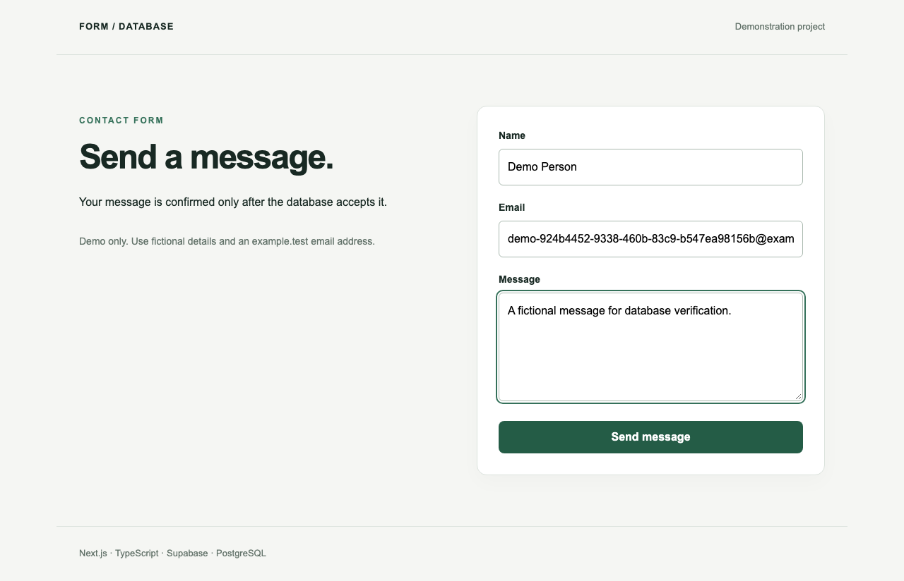
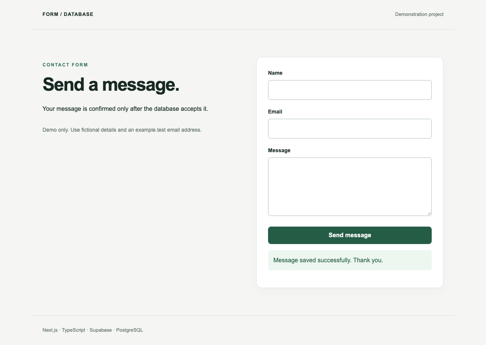
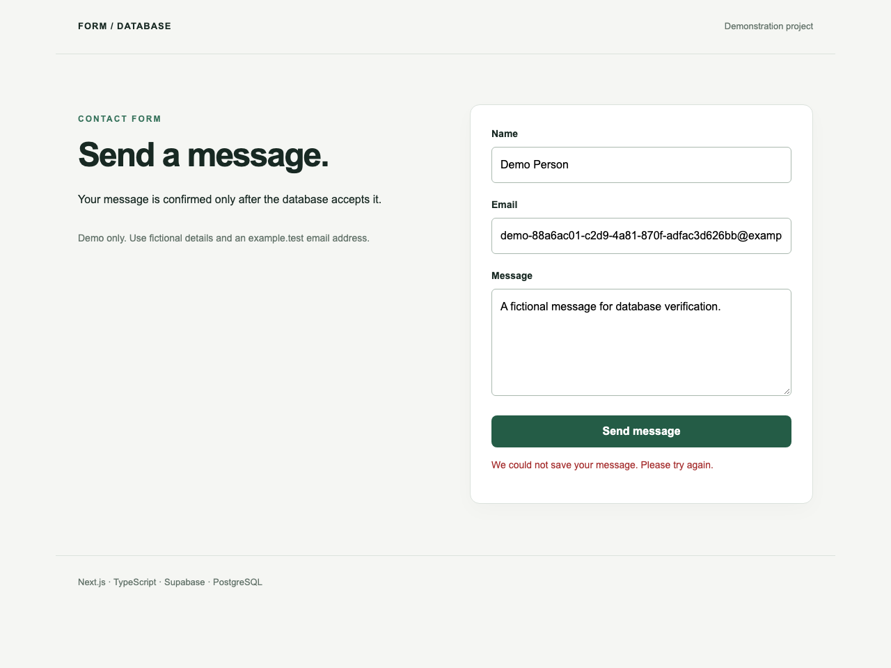
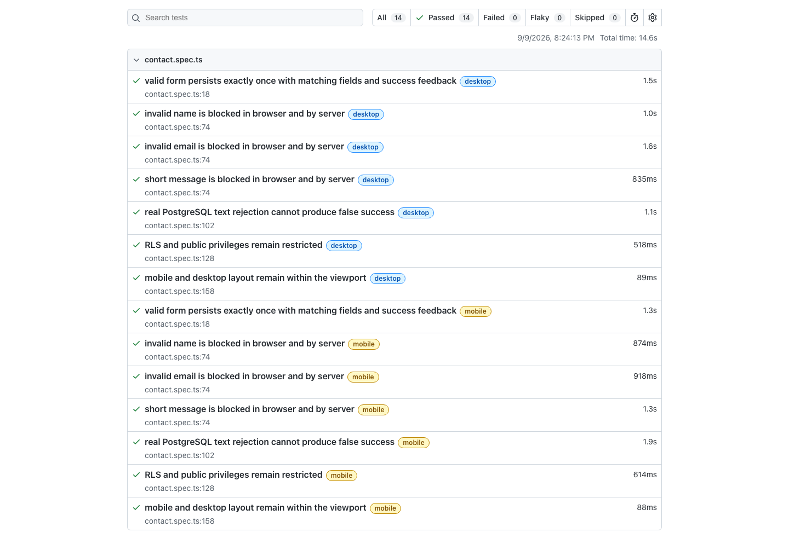
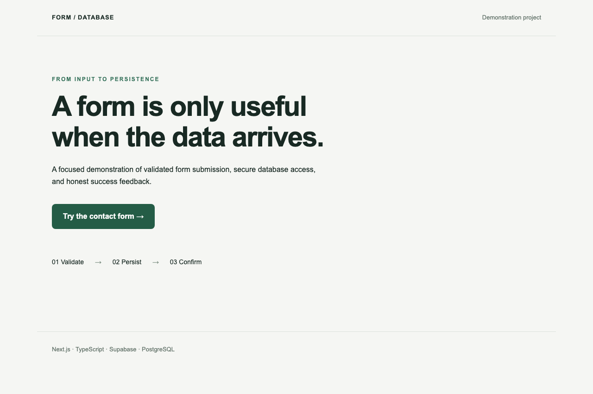

# Next.js + Supabase Form Persistence Troubleshooting Demo

## Purpose
Demonstration Project: verify the full path from a submitted form to a persisted PostgreSQL row. No client engagement or public deployment is implied.

## Stack
Node 24, Next.js App Router, React, TypeScript, Supabase JS, PostgreSQL, Playwright, ESLint.

## Features
- Home page and responsive contact form.
- Shared client/server validation: name 2–80, email up to 254, message 10–1000 characters.
- Loading lock, accessible field feedback, explicit success and error states.
- Anonymous INSERT only, restricted to fictional `demo-[id]@example.test` addresses.
- No public SELECT, UPDATE or DELETE; no privileged credentials in application code.
- Independent database verification and exact test-owned record cleanup.

## Troubleshooting Scenario
A controlled one-line regression changed INSERT to INSERT with returned rows. The write-only table rejected it because SELECT was intentionally denied. Removing the readback restored persistence without changing security. The unchanged test demonstrates baseline PASS → broken FAIL → fixed PASS. See [TROUBLESHOOTING.md](TROUBLESHOOTING.md).

## Screenshots

## Validation
15/15 unit tests and 14/14 real E2E passed on the fixed and merged application. Typecheck, lint and production build passed.
Run `npm test`, `npm run build`, `npm run typecheck`, `npm run lint`, and `npm run test:e2e`.
E2E runs against a production build on desktop and mobile. Success is checked against the database, including field equality and exactly one row. Invalid input is tested in both the browser and the server. A real PostgreSQL U+0000 text rejection tests error feedback without mocking persistence or changing database permissions.

## Running Locally
1. Install Node 24 (`nvm use` if using nvm), then `npm ci`.
2. Copy `.env.example` to `.env.local` and configure your isolated sandbox.
3. Apply the checked-in migration to that sandbox using authorized database administration.
4. Run `npm run dev`, then visit `/contact`. Use only fictional `demo-[id]@example.test` details.
5. For E2E, install Chromium with `npx playwright install chromium`, build, and run the suite. Port 3100 must be available.

## Environment Variables
- `NEXT_PUBLIC_SUPABASE_URL`: sandbox URL.
- `NEXT_PUBLIC_SUPABASE_PUBLISHABLE_KEY`: public application key; never a service-role key.
- `E2E_SUPABASE_PROJECT_REF`: explicit confirmation of the sandbox target. Required before any test management operation and must match the URL exactly.
- `SUPABASE_ACCESS_TOKEN`: test infrastructure only. Optional when an authorized local Supabase CLI Keychain entry is available. Never set this in a browser or application deployment.

No real values are versioned. Trace recording is disabled to avoid capturing configured URLs in browser artifacts. Management failures suppress response bodies and credentials.

## Project Status
**Demonstration Project.** The troubleshooting scenario is complete, independently reviewed and published as a technical portfolio sample. Baseline, broken and fixed tags are preserved. Independent source audit approved the minimal repair; cloud E2E was run on the implementation station. Not deployed as a public service. Public anonymous forms need an abuse-control strategy before internet exposure; this demo does not claim production rate limiting or exactly-once delivery across retries. A network timeout may leave the outcome uncertain; single-click locking prevents only concurrent submissions from this form.

## References
- [Supabase INSERT](https://supabase.com/docs/reference/javascript/insert)
- [Supabase row-level security](https://supabase.com/docs/guides/database/postgres/row-level-security)
- [Next.js Route Handlers](https://nextjs.org/docs/app/getting-started/route-handlers)

Tooling note: ESLint 9.39.5 is pinned for compatibility with the installed Next.js React lint plugin. It passes lint but is deprecated; an ESLint 10 upgrade needs compatible upstream tooling.
